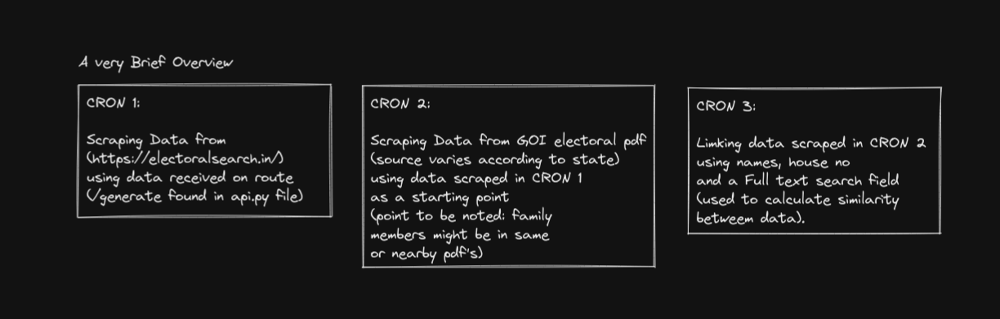

# Building Family tree using Electoral Data (India)

## A very brief overview but hopefully I'll update this soon. 


While working on this project (which was apparently a hiring challenge), I was able to scrape 25k+ data from the various sources and successfully built family trees. In my initial testing my approach accurately linked 3+ generations which will eventually produce greater depths given more time. It was fun.  


## Overview





## Tech/Tools At work

- OCR
- Language Transalation (hindi->english, tamli->english)
- Web Scraping
- Graphical Analysis
- Family Relationship Resolver
- Full Text Search with Text Similarity Score
- API's
- Patience: had to build this in 2 days and 2 days for bugs :))
- Automation
- CRON jobs


## Setup Tesseract (OCR)

```
https://tesseract-ocr.github.io/tessdoc/Installation.html

sudo apt install tesseract-ocr
sudo apt install libtesseract-dev

search language packs:  apt-cache search tesseract-ocr
lang-packs: https://github.com/tesseract-ocr/tessdata/tree/main/script
lang-location: /usr/share/tesseract-ocr/4.00/tessdata

```